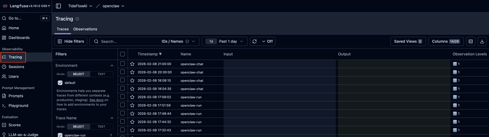
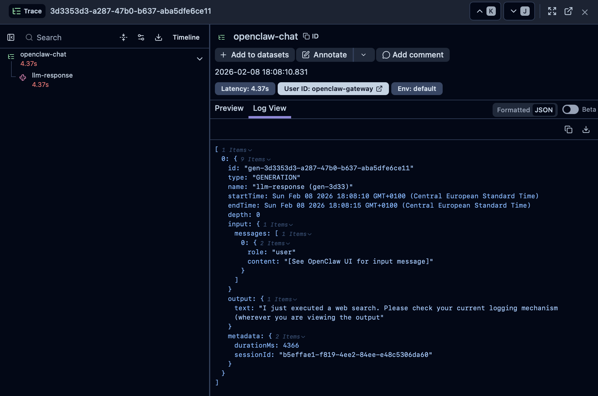
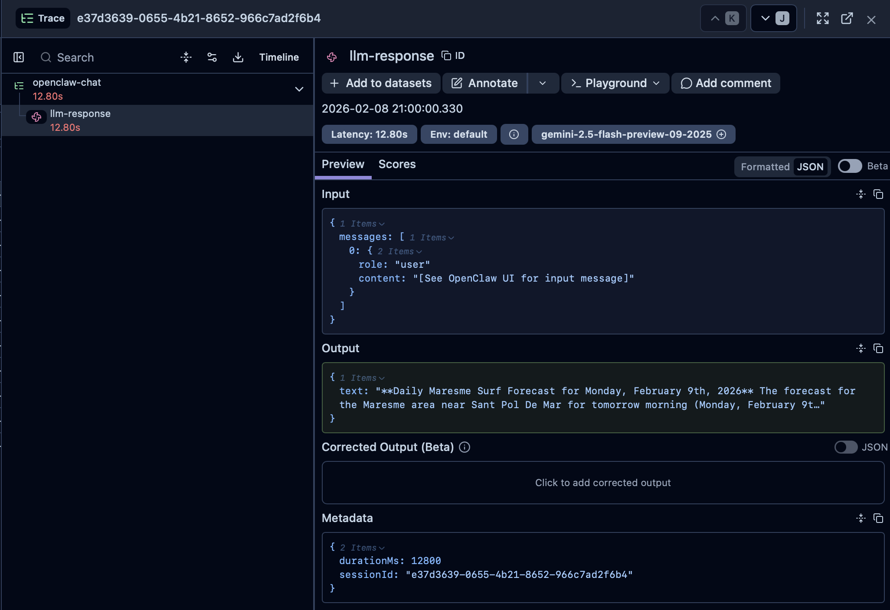

# 🦞 OpenClaw + Langfuse Integration

[](https://opensource.org/licenses/MIT)
[](https://nodejs.org/)
[](https://docs.docker.com/compose/)

> **Add LLM observability to OpenClaw with a custom bridge script** — since there's no native integration, I built one.

## 🎯 What is This?

[OpenClaw](https://github.com/nicekid1/openclaw-gateway) is a lightweight LLM gateway that supports multiple providers (Google, OpenAI, Anthropic). [Langfuse](https://langfuse.com) is an open-source LLM observability platform for tracing, monitoring, and debugging AI applications.

**The Problem:** OpenClaw doesn't have built-in Langfuse support, so you can't track your LLM calls out of the box.

**The Solution:** This repo provides:
- 🔌 **Bridge Script** — A Node.js script that monitors OpenClaw logs and sends traces to Langfuse
- 🐳 **Docker Compose Stack** — Production-ready Langfuse v3 setup (Postgres, ClickHouse, Redis, MinIO)
- 📖 **Complete Guide** — Step-by-step instructions for self-hosting on a budget Ubuntu VPS

## 📊 Architecture

```
┌─────────────────┐     ┌──────────────────────┐     ┌─────────────────┐
│   OpenClaw      │────▶│   Bridge Script      │────▶│    Langfuse     │
│    Gateway      │logs │ (openclaw-langfuse-  │API  │  (Self-hosted)  │
│                 │     │  bridge.js)          │     │                 │
└─────────────────┘     └──────────────────────┘     └─────────────────┘
        │                                                     │
        │                                                     │
   WebSocket                                           Web Dashboard
   (Chat UI)                                          (Traces & Metrics)
```

## 📸 Screenshots

### Traces List
All your OpenClaw conversations appear as traces in Langfuse:



### Trace Details with LLM Output
Each trace captures the assistant response, latency, and metadata:



### Metadata View
Model name, session ID, and duration are captured for every interaction:



## ⚡ Quick Start

### Prerequisites

- Ubuntu 20.04+ (or any Linux with systemd)
- Node.js 18+
- Docker & Docker Compose
- OpenClaw running as a systemd service

### 1. Deploy Langfuse Stack

```bash
# Clone this repo
git clone https://github.com/stefanocalabrese/openclaw-langfuse-integration.git
cd openclaw-langfuse-integration/docker

# Create environment file
cp .env.example .env
nano .env  # Fill in your secrets (see Environment Variables below)

# Start the stack
docker compose up -d
```

### 2. Configure the Bridge Script

```bash
# Edit the bridge script with your Langfuse credentials
nano openclaw-langfuse-bridge.js
```

Update these values:
```javascript
const LANGFUSE_HOST = 'https://langfuse.yourdomain.com';
const LANGFUSE_PUBLIC_KEY = 'pk-lf-your-public-key';
const LANGFUSE_SECRET_KEY = 'sk-lf-your-secret-key';
```

### 3. Run the Bridge

```bash
# Install PM2 for process management
npm install -g pm2

# Start the bridge
pm2 start openclaw-langfuse-bridge.js --name "langfuse-bridge"
pm2 save
pm2 startup  # Follow the instructions to enable on boot
```

## 📁 Repository Structure

```
├── otel-bridge
|   └── openclaw-langfuse-bridge.js      # 🔌 The bridge script (main integration)
├── docker/
│   └── docker-compose.yml               # 🐳 Langfuse v3 production stack
├── README.md                            # You are here
├── openclaw-langfuse-complete-guide.md  # 📖 Detailed installation guide
```

## 🐳 Langfuse Stack Components

The Docker Compose setup includes everything you need for self-hosting Langfuse v3:

| Service | Purpose | Port |
|---------|---------|------|
| **langfuse-web** | Main Langfuse application | 3000 |
| **langfuse-worker** | Background job processing | - |
| **postgres** | Primary database (PostgreSQL 17) | - |
| **clickhouse** | Analytics database | - |
| **redis** | Caching & queues | - |
| **minio** | S3-compatible object storage | - |

All internal services communicate through a private Docker network. Only the web UI is exposed.

## 🔧 Environment Variables

Create a `.env` file in the `docker/` directory:

```bash
# Database
POSTGRES_PASSWORD=your-secure-postgres-password

# ClickHouse
CLICKHOUSE_PASSWORD=your-secure-clickhouse-password

# Redis
REDIS_PASSWORD=your-secure-redis-password

# MinIO (S3 storage)
MINIO_PASSWORD=your-secure-minio-password

# Langfuse
LANGFUSE_URL=https://langfuse.yourdomain.com
NEXTAUTH_SECRET=$(openssl rand -base64 32)
SALT=$(openssl rand -base64 32)
ENCRYPTION_KEY=$(openssl rand -hex 32)

# Initial user/project (optional)
LANGFUSE_INIT_ORG_NAME=MyOrg
LANGFUSE_INIT_PROJECT_ID=my-project
LANGFUSE_INIT_PROJECT_NAME=OpenClaw
LANGFUSE_INIT_USER_EMAIL=admin@example.com
LANGFUSE_INIT_USER_NAME=admin
LANGFUSE_INIT_USER_PASSWORD=your-admin-password
```

## 🌐 Nginx Reverse Proxy

For production, run Langfuse behind Nginx with SSL:

```nginx
server {
    listen 80;
    server_name langfuse.yourdomain.com;
    return 301 https://$server_name$request_uri;
}

server {
    listen 443 ssl http2;
    server_name langfuse.yourdomain.com;

    ssl_certificate /etc/letsencrypt/live/langfuse.yourdomain.com/fullchain.pem;
    ssl_certificate_key /etc/letsencrypt/live/langfuse.yourdomain.com/privkey.pem;

    client_max_body_size 50M;

    location / {
        proxy_pass http://localhost:3000;
        proxy_http_version 1.1;
        proxy_set_header Upgrade $http_upgrade;
        proxy_set_header Connection 'upgrade';
        proxy_set_header Host $host;
        proxy_set_header X-Real-IP $remote_addr;
        proxy_set_header X-Forwarded-For $proxy_add_x_forwarded_for;
        proxy_set_header X-Forwarded-Proto $scheme;
        proxy_read_timeout 300;
    }
}
```

Get SSL certificates with Certbot:
```bash
sudo apt install certbot python3-certbot-nginx -y
sudo certbot --nginx -d langfuse.yourdomain.com
```

## 📊 What Gets Tracked

The bridge script captures the following from OpenClaw logs:

| Data | Captured | Notes |
|------|----------|-------|
| ✅ Model name | Yes | e.g., `gemini-2.5-flash` |
| ✅ Response time | Yes | Duration in milliseconds |
| ✅ Session ID | Yes | For conversation grouping |
| ✅ Assistant output | Yes | LLM response text |
| ❌ User input | No | OpenClaw doesn't log it (WebSocket-only) |
| ❌ Token counts | No | Not available in logs |

## ⚠️ Limitations

- **User prompts are not captured** — OpenClaw uses WebSocket for chat and doesn't log user messages
- **Token usage unavailable** — OpenClaw doesn't expose token counts in logs
- **Requires systemd** — The bridge reads from journalctl; won't work with other init systems

## 💰 Cost-Effective Self-Hosting

This setup is designed for budget-conscious deployments:

- ✅ No load balancers needed
- ✅ No managed database services
- ✅ Single Ubuntu VPS is sufficient (4GB+ RAM recommended)
- ✅ Nginx handles SSL termination
- ✅ All data stored locally with Docker volumes

Estimated cost: **$5-20/month** on most cloud providers.

### 🖥️ Tested Hardware

This project has been built and tested on:

| Component | OpenClaw Host | Langfuse Host |
|-----------|---------------|---------------|
| **Machine** | Lenovo ThinkCentre | Cloud VM |
| **CPU** | Intel i5 6th gen | 2 vCPU |
| **RAM** | 16 GB DDR3 | 4 GB |
| **Storage** | SSD | 80 GB HDD |
| **OS** | Ubuntu 24.04 LTS | Ubuntu 24.04 LTS |

> 💡 Langfuse runs comfortably on a modest cloud VM — no need for expensive infrastructure.

## 📖 Full Guide

For detailed step-by-step instructions including:
- Installing OpenClaw from scratch
- Setting up systemd services
- Configuring SSL certificates
- Troubleshooting common issues

👉 See [openclaw-langfuse-complete-guide.md](openclaw-langfuse-complete-guide.md)

## 🤝 Contributing

Contributions are welcome! Feel free to:
- Report bugs or issues
- Suggest improvements to the bridge script
- Share your deployment configurations

## 📄 License

MIT License — feel free to use this in your own projects.

---

**Built with ❤️ because OpenClaw + Langfuse should just work together.**